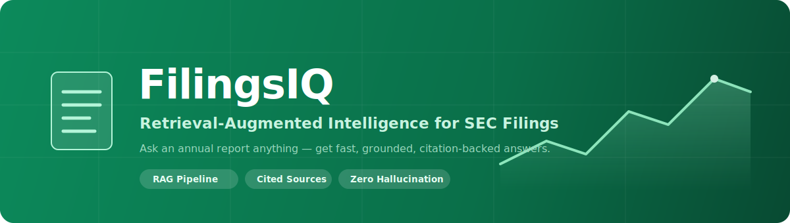
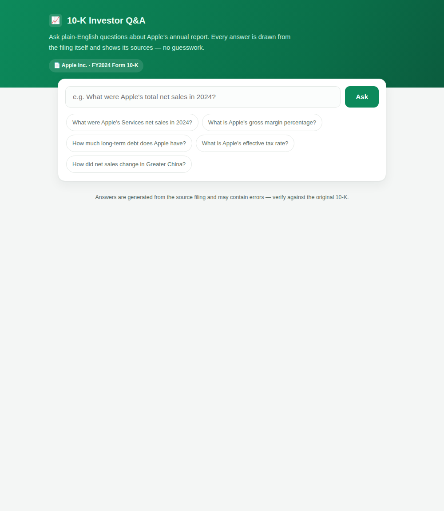
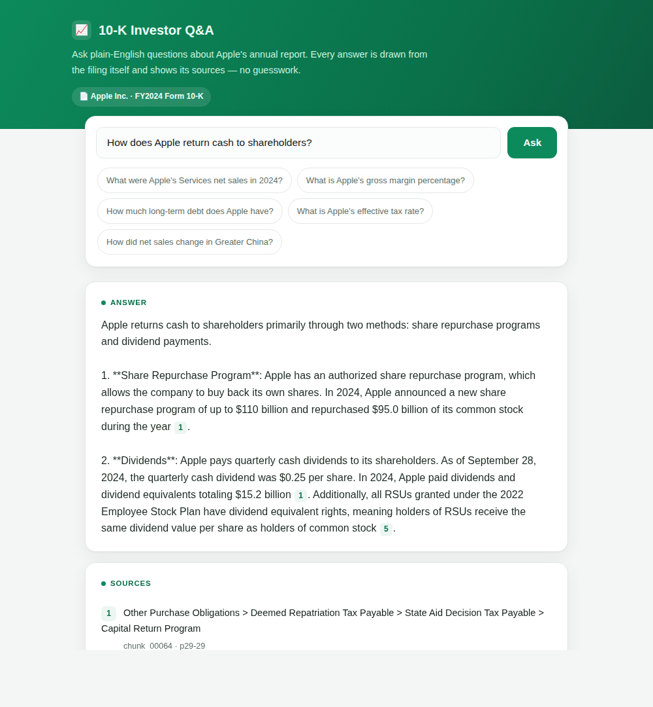
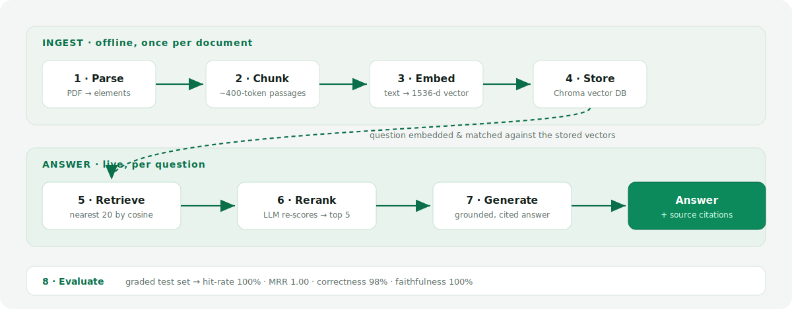
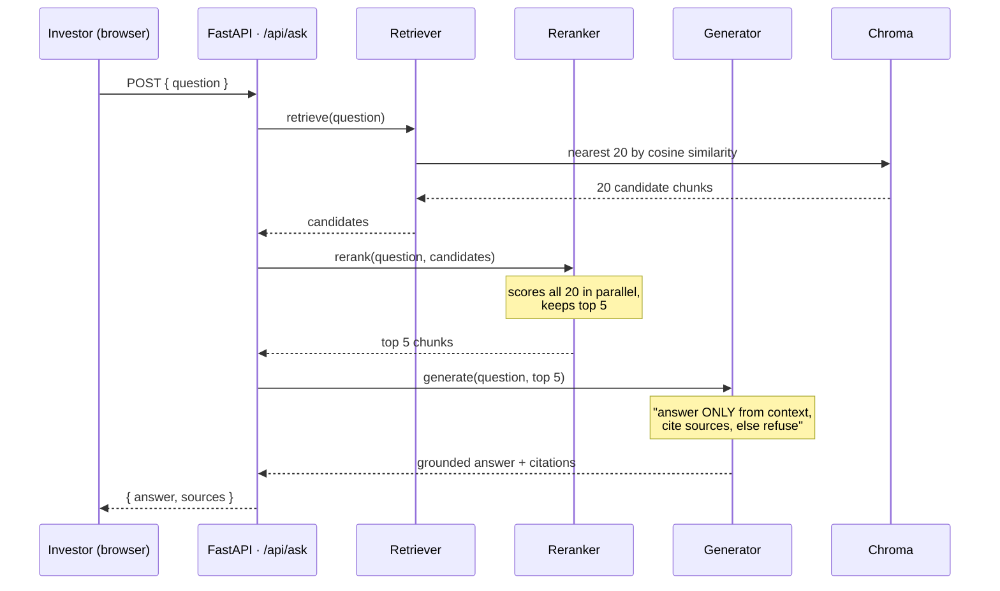

<p align="center">
  
</p>

<h1 align="center">FilingsIQ</h1>
<p align="center"><strong>Retrieval-Augmented Intelligence for SEC Filings</strong></p>
<p align="center">Ask a company's annual report anything — and get fast, grounded, citation-backed answers, with zero hallucination.</p>

<p align="center">
  
  
  
  
  
</p>

---

## 📌 What is this?

A company's **10-K** (annual report) is ~120 pages of dense financial and legal text. Finding one fact means either reading it all, or asking a general chatbot that **makes numbers up**.

**FilingsIQ** is a full **Retrieval-Augmented Generation (RAG)** system that fixes this. You ask a plain-English question; it finds the exact passages in the filing, reads them, and writes a **grounded answer with citations** — and honestly says *"I can't find that"* when the document doesn't contain the answer.

It currently ships with **Apple Inc.'s FY2024 Form 10-K** indexed and ready to query.

| | |
|---|---|
|  |  |
| *Ask box with example questions* | *Grounded answer with inline citations and sources* |

---

## ✨ Features

- **Grounded answers, not guesses** — every answer is built only from passages retrieved from the filing.
- **Inline citations** — each answer cites the exact chunks `[1] [2]` and lists their section + page.
- **Refuses to hallucinate** — when the filing doesn't cover something, it says so instead of inventing facts.
- **Reasons over numbers** — computes percentages, sums and differences from figures in the document.
- **Two-stage retrieval** — fast vector search casts a wide net; an LLM reranker re-orders for true relevance.
- **Self-evaluating** — a graded test set scores the pipeline objectively (no eyeballing).
- **Clean web UI + JSON API** — one FastAPI app serves both, on a single origin (no CORS setup).

---

## 🏗️ Architecture

<p align="center">
  
</p>

The system has two halves:

- **Ingest (offline, once per document):** turn a PDF into a searchable vector index.
- **Answer (live, per question):** turn a question into a grounded, cited answer.

### The 8 stages

| # | Stage | What it does | Key tech |
|---|-------|--------------|----------|
| 1 | **Parse** | Break the PDF into clean, typed elements (titles, paragraphs, tables) | `unstructured`, `PyMuPDF`, YOLOX layout model |
| 2 | **Chunk** | Group elements into ~400-token passages, preserving section breadcrumbs | `tiktoken` (`cl100k_base`) |
| 3 | **Embed** | Turn each passage into a 1536-dimension meaning vector | OpenAI `text-embedding-3-small` |
| 4 | **Store** | Save vectors + text + metadata in a searchable index | Chroma (HNSW, cosine) |
| 5 | **Retrieve** | Embed the question, fetch the nearest 20 passages | Chroma vector search |
| 6 | **Rerank** | An LLM re-scores each passage against the question, keeps the best 5 | OpenAI `gpt-4o-mini` (parallel) |
| 7 | **Generate** | Write a grounded, cited answer from the top passages | OpenAI `gpt-4o` |
| 8 | **Evaluate** | Score the whole pipeline against a ground-truth test set | LLM-as-judge + retrieval metrics |

### Request flow



---

## 🔬 Inside the pipeline — a worked example

To make the data flow concrete, here is **one real piece of content** — the paragraph about Apple's
*Wearables* — traced through every stage, showing exactly what each step produced and handed to the next.

### Ingest

**Stage 1 · Parse** — the raw PDF page becomes typed, labelled elements.

```
Input : a page of the Apple 10-K PDF (just ink, no structure)
Output: { element_id: "el_00092", type: "NarrativeText", page: 4,
          text: "Wearables includes smartwatches, wireless headphones and spatial computers…" }
        … plus el_00091 (Title "Wearables, Home and Accessories"), el_00093, el_00094
➜ passed on: a list of typed elements
```

**Stage 2 · Chunk** — small elements are grouped into one search-sized passage, with provenance.

```
Input : el_00092, el_00093, el_00094  (3 parsed elements)
Output: { chunk_id: "chunk_00008",
          text: "Wearables includes smartwatches… Home includes Apple TV… Accessories…",
          token_count: 153,
          source_element_ids: ["el_00092","el_00093","el_00094"],     # provenance
          section_path: ["Item 1. Business","Company Background","Products",
                         "Wearables, Home and Accessories"] }          # breadcrumb
➜ passed on: a chunk (right-sized, with its section breadcrumb)
```

**Stage 3 · Embed** — the chunk's text (prefixed with its breadcrumb) becomes a meaning vector.

```
Input : "Item 1. Business > … > Wearables, Home and Accessories\n\nWearables includes smartwatches…"
Output: [0.0187, 0.0057, -0.0058, 0.0198, … ]   # 1536 numbers, magnitude ≈ 1.0
➜ passed on: the chunk + its embedding
```

**Stage 4 · Store** — the chunk lands as one row in the Chroma vector database.

```
Input : chunk_00008 + its 1536-d vector
Output: a row →  id: "chunk_00008"
                 document: "Wearables includes smartwatches…"
                 metadata: { section_path, first_page: 4, last_page: 4,
                             element_type: "prose", token_count: 153, source_element_ids }
                 embedding: [0.0187, 0.0057, …]
➜ stored on disk, indexed for fast nearest-neighbour search
```

### Answer

**Stage 5 · Retrieve** — the question is embedded and matched against all stored vectors.

```
Input : "What wearables and smart home products does Apple make?"
Process: embed the question → compare to all 263 vectors by cosine similarity
Output: top-20 candidates, e.g.  #1 chunk_00008  (similarity 0.70)  ← the Wearables chunk wins
➜ passed on: 20 candidate chunks
```

**Stage 6 · Rerank** — an LLM re-reads the question + each candidate together and re-scores.

```
Input : the question + 20 candidates
Process: score each (question, chunk) pair 0–10 for "does this answer it?"  (run in parallel)
Output: re-sorted, trimmed to top 5  →  chunk_00008 stays #1
➜ passed on: the 5 best chunks
```

**Stage 7 · Generate** — the top chunks become the context for a grounded, cited answer.

```
Input : the question + top-5 chunks as numbered CONTEXT
Process: LLM answers using ONLY that context, cites passages, refuses if absent
Output: "Apple's wearables include Apple Watch, AirPods and Beats, and Apple Vision Pro… [1]"
        sources: [ { number: 1, chunk_id: "chunk_00008", section: "… > Wearables…", pages: "p4-4" } ]
➜ returned to the user
```

### The journey in one line

```
PDF page → el_00091/92/93/94 → chunk_00008 → [0.0187, 0.0057, …] → Chroma row
         → retrieved (0.70) → reranked (#1) → cited answer
```

One paragraph about Apple Watch travels from raw ink to a typed element, to a right-sized chunk, to a
fingerprint, to a stored row — then, at question time, back out as the top hit and into a cited answer.
The same path runs for all **263** chunks.

---

## 🧰 Tech stack

| Layer | Technology |
|-------|------------|
| **Parsing** | `unstructured` (+ YOLOX layout detection), `PyMuPDF` |
| **Tokenization** | `tiktoken` |
| **Embeddings** | OpenAI `text-embedding-3-small` (1536-d) |
| **Vector store** | Chroma (local, persistent, HNSW index, cosine distance) |
| **Reranker / Generator / Judge** | OpenAI `gpt-4o-mini` / `gpt-4o` / `gpt-4o` |
| **Config** | Pydantic v2 + `pydantic-settings` (YAML + env + `.env`) |
| **Logging** | `loguru` |
| **API** | FastAPI + Uvicorn |
| **Frontend** | Vanilla HTML / CSS / JS (no build step) |

---

## 📂 Project structure

```
rag-system/
├── api/
│   ├── main.py              # FastAPI app: /api/ask, /api/health, serves the UI
│   └── static/index.html    # Investor frontend (single page)
├── src/
│   ├── pipeline.py          # RAGPipeline: retrieve → rerank → generate
│   ├── parsing/             # Stage 1 — PDF → elements
│   ├── chunking/            # Stage 2 — elements → chunks
│   ├── embeddings/          # Stage 3 — chunks → vectors
│   ├── storage/             # Stage 4 — Chroma vector store
│   ├── retrieval/           # Stage 5 — question → nearest chunks
│   ├── reranking/           # Stage 6 — LLM re-scoring
│   ├── generation/          # Stage 7 — grounded answer
│   ├── evaluation/          # Stage 8 — metrics + LLM judge
│   └── common/              # config, paths, logging
├── config/default.yaml      # All tunable settings
├── eval/testset.json        # Ground-truth Q&A for evaluation
├── data/                    # raw PDFs, parsed, chunks, embeddings, vector_store
└── requirements.txt
```

Each stage follows the same house style: a **config block** → a **Pydantic data model** → a **logic module**.

---

## 🚀 Getting started

### 1. Prerequisites

- Python 3.11
- An OpenAI API key

### 2. Install

```bash
python -m venv .venv && source .venv/bin/activate
pip install -r requirements.txt
```

### 3. Configure

Create a `.env` file in the project root:

```bash
OPENAI_API_KEY=sk-...your-key...
```

All other settings live in `config/default.yaml` and can be overridden via environment
variables (e.g. `GENERATION__MODEL=gpt-4o-mini`).

### 4. Run the app

```bash
uvicorn api.main:app --port 8500
```

Open **http://127.0.0.1:8500** and start asking questions.

> The Apple 10-K index ships pre-built in `data/vector_store/`, so the app works out of the box —
> no ingest needed.

---

## 🔌 API reference

### `POST /api/ask`

```bash
curl -X POST http://127.0.0.1:8500/api/ask \
  -H "Content-Type: application/json" \
  -d '{"question": "How does Apple return cash to shareholders?"}'
```

```json
{
  "question": "How does Apple return cash to shareholders?",
  "answer": "Apple returns cash to shareholders primarily through share repurchase programs and the payment of dividends ... [1]",
  "sources": [
    {
      "number": 1,
      "chunk_id": "chunk_00064",
      "section": "... > Capital Return Program",
      "pages": "p29-29"
    }
  ],
  "model": "gpt-4o"
}
```

### `GET /api/health`

```json
{ "status": "ok", "vectors": 263 }
```

### Deep links

`GET /?q=<url-encoded question>` opens the UI and runs the question automatically — handy for sharing.

---

## 📊 Evaluation

Quality is measured, not eyeballed. `eval/testset.json` holds ground-truth questions paired with
their known answers and the chunk(s) that prove them. The evaluator runs the full pipeline on each
and scores it two ways:

- **Retrieval (objective):** did the correct chunk land in the top-k, and how high? → `hit-rate`, `MRR`
- **Answer (LLM-judged):** does it match the reference, and is every claim grounded? → `correctness`, `faithfulness`

**Latest run:**

| Metric | Score |
|--------|-------|
| Retrieval hit-rate @5 | **100%** |
| Retrieval MRR | **1.00** |
| Answer correctness | **98%** |
| Answer faithfulness | **100%** |

---

## ⚙️ Configuration highlights

All in `config/default.yaml`:

| Key | Meaning | Default |
|-----|---------|---------|
| `embedding.model` | Embedding model | `text-embedding-3-small` |
| `storage.distance` | Vector distance metric | `cosine` |
| `rerank.candidate_k` | How many chunks retrieval fetches before reranking | `20` |
| `rerank.top_n` | How many chunks survive reranking | `5` |
| `rerank.max_workers` | Concurrent rerank calls (latency) | `10` |
| `generation.model` | Answer-writing model | `gpt-4o` |
| `generation.temperature` | `0.0` = deterministic, grounded | `0.0` |

---

## 🧭 Notes & limitations

- Indexed for **one document** (Apple FY2024 10-K). The pipeline is document-agnostic; ingesting a new
  filing is a matter of running stages 1–4 on its PDF.
- Answers can still contain errors — the UI shows a disclaimer and always cites sources so claims are verifiable.
- The reranker and judge are LLMs, so scores carry mild, expected variance.

---

## 🗂️ Scaling to multiple filings (multi-company)

Today the index holds one document. Supporting many companies — so an investor could pick *Microsoft*,
*Nvidia* or *SpaceX* and ask about that filing — needs **surprisingly little change**, because the
pipeline is already company-agnostic. The key idea is a single new metadata field: **`company`**.

**1. Tag every chunk with its company.** All filings live in the same vector store, each chunk
labelled with whose document it came from:

```
chunk_00064 | company: "AAPL" | section: Capital Return Program | text: "…"
chunk_00210 | company: "MSFT" | section: Share Repurchases      | text: "…"
chunk_00088 | company: "NVDA" | section: Data Center Revenue     | text: "…"
```

**2. Filter the search by company.** When the user selects a company, retrieval adds a filter so the
question only matches that company's chunks — never another's by accident:

```python
store.search(question_vector, where={"company": "MSFT"})
#                              └──────────────────────────┘
#         "only compare against Microsoft's vectors, ignore the rest"
```

Chroma supports this metadata filter natively — it's a one-line addition.

**What actually changes in the code:**

| Stage | Change |
|-------|--------|
| Parse / Chunk / Embed | **None** — they process whatever PDF they're given |
| Store (`_to_metadata`) | Add `"company": company_id` to each chunk's metadata — *~1 line* |
| Retrieve | Accept a `company` argument, pass it as Chroma's `where` filter — *a few lines* |
| Rerank / Generate / Evaluate | **None** — they work on whatever chunks retrieval returns |

**Onboarding a new filing** then becomes: drop the PDF in `data/raw/`, run the ingest with
`company="SPACEX"`, done — investors can immediately query it. The answer path doesn't change at all.

**Two ways to organise it:**

| Approach | How | Best when |
|----------|-----|-----------|
| **One store + `company` filter** *(recommended)* | All companies in one collection, filtered by metadata | Dozens of companies, simple to manage |
| **One store per company** | `chunks_aapl`, `chunks_msft`, … | Hundreds of companies, or strict isolation |

In short: **tag chunks with a company, filter searches by it** — the ingest runs once per new document
and the rest of the system is untouched.

---

## 🗺️ Roadmap

- Stream the answer token-by-token (feels faster)
- Multi-company support (the approach above)
- Deploy behind a public URL

---

<p align="center"><sub>Built as an end-to-end RAG learning project — parse → chunk → embed → store → retrieve → rerank → generate → evaluate.</sub></p>
